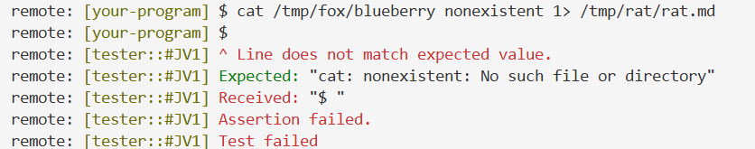

# debug log
---
1.6
* split_redirect 两个控制信息改成返回枚举（注意添加#[derive()信息]）, echo 分支单独加非常麻烦
* if let 匹配值 = 源变量 {语句块1} else {语句块2}， if let 可以看成是只有两个分支的match 语法糖
---
1.5 晚
* 出现了很多value used\borrowed after move, 加深对所有权的理解
* 注意， 参数传递进入函数， 除了所有权转移， 作用域也转移了， 函数返回值这是将所有权传出给caller
* .clone(), 在heap上又复制了一份数据
* &， stack上多了一个指向stack某处的指针，通过租借所有权来理解， 单独的&是只读租借， 可以允许多次租借
* mut&， 可变引用， 只能引用一次， 要求创建变量时已经显式声明，这是rust对并发状态下在编译期预防数据访问碰撞的机制， 可以猜到， 借用存活期间原值（所有者）不能被读写
* 由于对象具有显式的生命周期， 编译期就能发现悬垂引用并报错
* 对于某容器xx， &xx 是借用容器本身， xx.as_ref借出了内部值，eg: String.as_ref() -> &str
* Option<T>, 不是容器， 而是枚举， 没有多余的内存消耗，只是使用时仍需遵循所有权语义， as_ref(), as_mut()同样适用，产生这种类型要么是Some(xx), 要么是None， 对它解包用.unwarp(), 因为用的很多， 所以记下来

      * cat file1 file2 , 第一个读到了，stdout成功写入.md, 第二个失败了， stderr没有成功打印到终端
   
* 这种在原生shell里面跑小shell还可以到处访问增删查改的感觉哈哈哈哈

1.5 傍晚
* 继续重构， 添加quote功能
* rfind会造成echo "xxx>1xxx"  的风险

1.5

* refactoring branch "extern command" and "echo", to add redirection func, ahhhh!
   * add utils: split_redirect(), 先判断有无>>, 再判断有无>, 返回tuple
* 目前extern command分支不太好看， 先跑起来再说吧， output应该写在branch ">" , ">>"最前面
* 原来的一版更离谱， find_exec_in_path 在 三个分支里面写了三遍

* after refactoring, direct enter cause panic
* 其实现在有问题， cd and type, what if user inputs cdxxxx or typexxxx, it stills enter cd or type branch,只是测试用例没有覆盖这里


---
This is a starting point for Rust solutions to the
["Build Your Own Shell" Challenge](https://app.codecrafters.io/courses/shell/overview).

In this challenge, you'll build your own POSIX compliant shell that's capable of
interpreting shell commands, running external programs and builtin commands like
cd, pwd, echo and more. Along the way, you'll learn about shell command parsing,
REPLs, builtin commands, and more.

**Note**: If you're viewing this repo on GitHub, head over to0
[codecrafters.io](https://codecrafters.io) to try the challenge.

# Passing the first stage

The entry point for your `shell` implementation is in `src/main.rs`. Study and
uncomment the relevant code, and push your changes to pass the first stage:

```sh
git commit -am "pass 1st stage" # any msg
git push origin master
```

Time to move on to the next stage!

# Stage 2 & beyond

Note: This section is for stages 2 and beyond.

1. Ensure you have `cargo (1.91)` installed locally
1. Run `./your_program.sh` to run your program, which is implemented in
   `src/main.rs`. This command compiles your Rust project, so it might be slow
   the first time you run it. Subsequent runs will be fast.
1. Commit your changes and run `git push origin master` to submit your solution
   to CodeCrafters. Test output will be streamed to your terminal.
